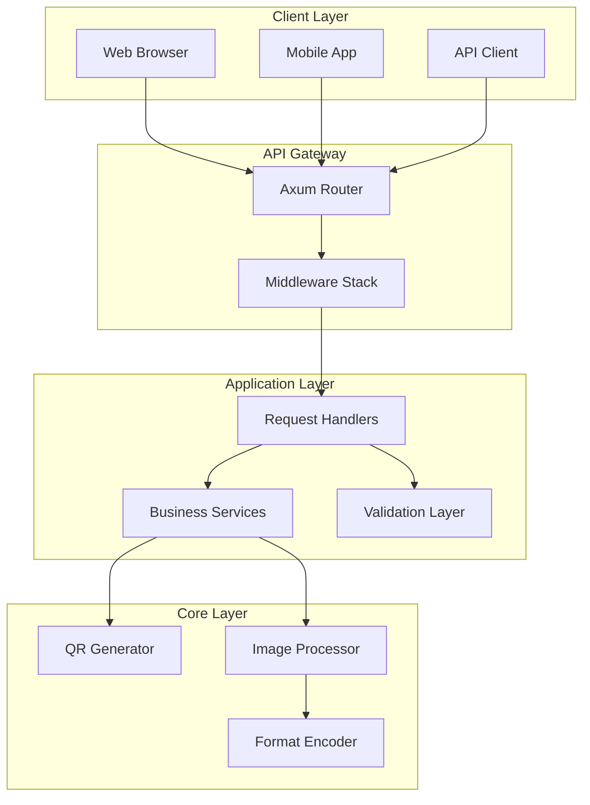
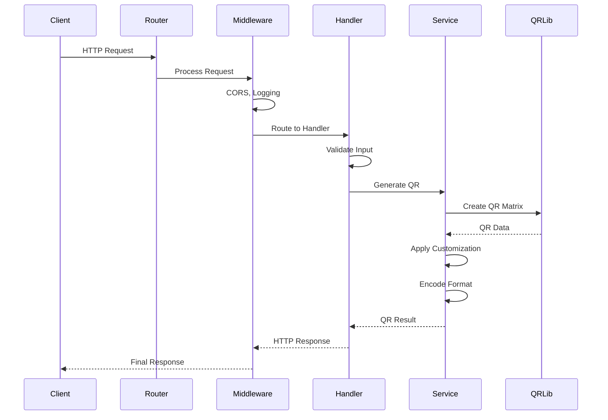
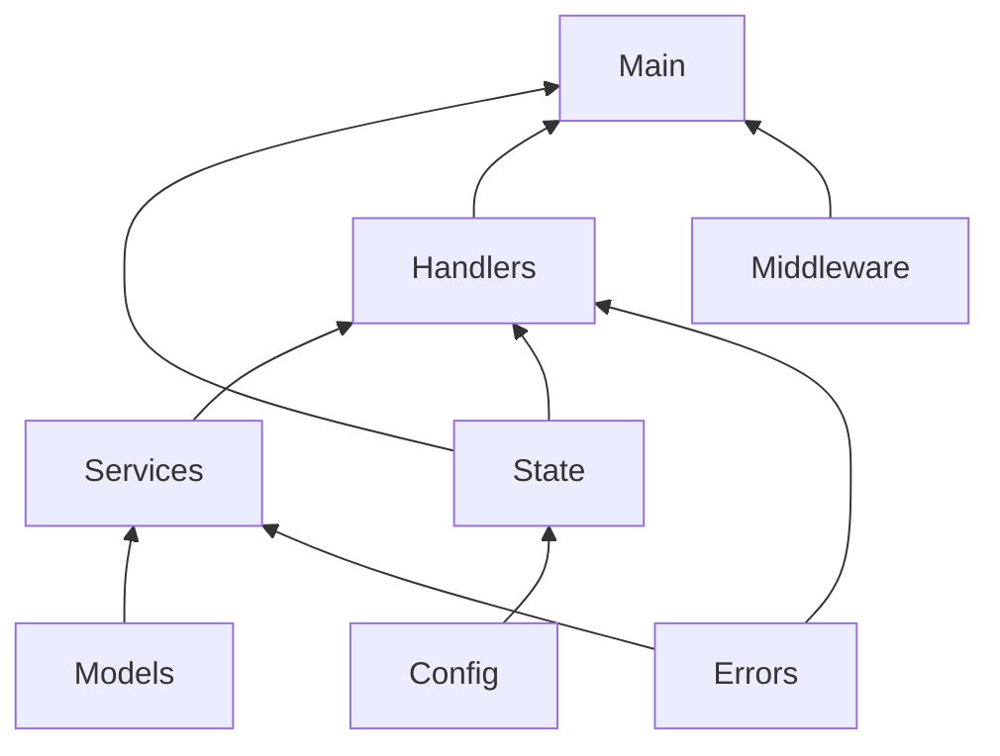
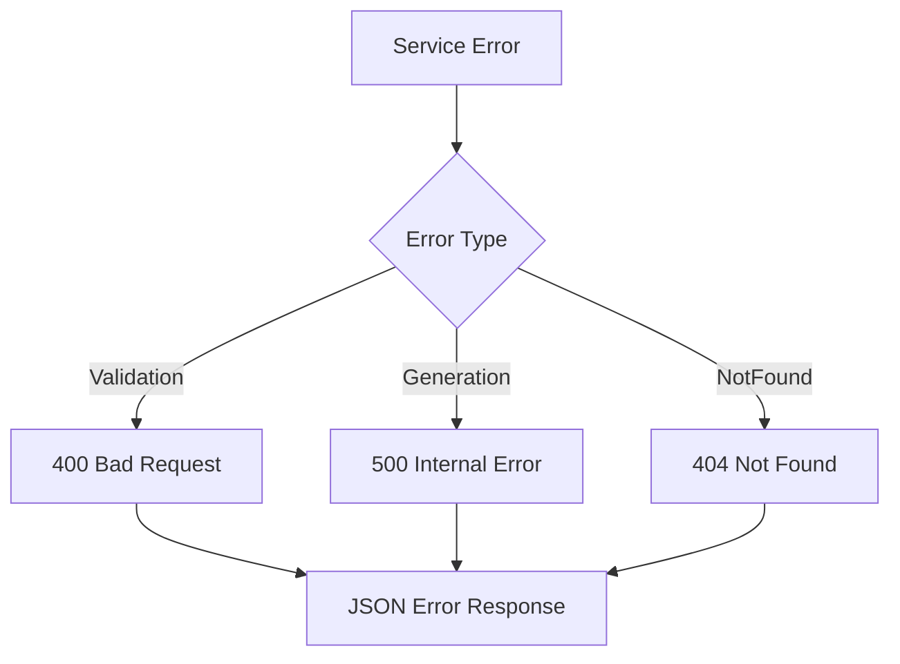
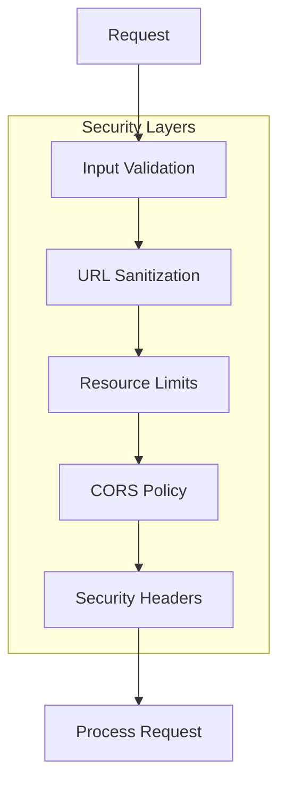
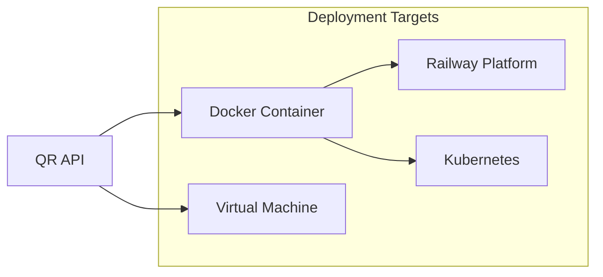
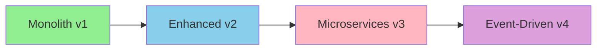

# 🏗️ QR Code API Architecture

> **Technical architecture and design documentation for the QR Code Generator API**  
> Version 2.0.0 | Last Updated: August 2025

## 📋 Table of Contents

- [System Overview](#-system-overview)
- [Architecture Principles](#-architecture-principles)
- [Component Architecture](#-component-architecture)
- [Data Flow](#-data-flow)
- [Module Structure](#-module-structure)
- [API Design](#-api-design)
- [State Management](#-state-management)
- [Error Handling](#-error-handling)
- [Performance Considerations](#-performance-considerations)
- [Security Architecture](#-security-architecture)
- [Deployment Architecture](#-deployment-architecture)
- [Future Architecture](#-future-architecture)

## 🎯 System Overview

### High-Level Architecture



### Technology Stack

| Layer | Technology | Purpose |
|-------|------------|---------|
| **Runtime** | Tokio | Async runtime for handling concurrent requests |
| **Framework** | Axum | Modern, type-safe web framework |
| **QR Generation** | qrcode-rust | Core QR code generation |
| **Image Processing** | image-rs | Image manipulation and encoding |
| **Serialization** | Serde | JSON request/response handling |
| **Logging** | Tracing | Structured logging and diagnostics |
| **Middleware** | Tower | Composable middleware stack |

## 🎨 Architecture Principles

### Design Principles

1. **Separation of Concerns**
   - Clear boundaries between layers
   - Single responsibility per module
   - Minimal coupling between components

2. **Type Safety**
   - Leverage Rust's type system
   - Compile-time validation
   - Zero-cost abstractions

3. **Performance First**
   - Async/await for concurrency
   - Zero-copy where possible
   - Efficient memory usage

4. **Extensibility**
   - Plugin-style service architecture
   - Version-based API evolution
   - Backward compatibility

5. **Testability**
   - Dependency injection via state
   - Mock-friendly interfaces
   - Isolated unit tests

## 🔧 Component Architecture

### Core Components

```rust
// Component relationships
┌─────────────────────────────────────────┐
│              main.rs                     │
│  - Application bootstrap                 │
│  - Server configuration                  │
│  - Route registration                    │
└────────────┬────────────────────────────┘
             │
    ┌────────┴────────┬───────────┬────────────┐
    │                 │           │            │
┌───▼────┐    ┌──────▼─────┐ ┌──▼───┐  ┌─────▼────┐
│ Config │    │  Handlers  │ │ State│  │Middleware│
└────────┘    └──────┬─────┘ └──────┘  └──────────┘
                     │
              ┌──────▼─────┐
              │  Services  │
              └──────┬─────┘
                     │
              ┌──────▼─────┐
              │   Models   │
              └────────────┘
```

### Module Responsibilities

#### `/src/main.rs`
- Application entry point
- Server initialization
- Route configuration
- Graceful shutdown handling

#### `/src/config/`
- Environment variable parsing
- Configuration validation
- Default value management
- Runtime configuration access

#### `/src/handlers/`
- HTTP request processing
- Request validation
- Response formatting
- Error transformation

#### `/src/services/`
- Business logic implementation
- QR code generation orchestration
- Image processing coordination
- Format conversion

#### `/src/models/`
- Request/response DTOs
- Domain models
- Type definitions
- Validation rules

#### `/src/middleware/`
- Request logging
- CORS handling
- Error recovery
- Performance monitoring

#### `/src/errors/`
- Error type definitions
- Error mapping
- HTTP status resolution
- Error response formatting

#### `/src/state.rs`
- Application state container
- Shared resource management
- Configuration caching
- Service initialization

## 🔄 Data Flow

### Request Lifecycle



### Data Transformation Pipeline

```rust
// Request → Validation → Processing → Response

// 1. Raw Request
POST /v2/generate
{
  "url": "https://example.com",
  "customization": {...}
}

// 2. Validated Model
QrRequestV2 {
    url: ValidatedUrl("https://example.com"),
    customization: QrCustomization {
        size: QrSize::Medium,
        error_correction: ErrorCorrectionLevel::M,
        colors: ColorScheme::default(),
        format: OutputFormat::Png,
    }
}

// 3. Service Processing
QrGenerationTask {
    content: String,
    options: QrOptions,
    encoder: ImageEncoder,
}

// 4. Response Model
QrResponseV2 {
    qr_code: Base64String,
    metadata: QrMetadata,
}
```

## 📁 Module Structure

### Directory Layout

```
src/
├── main.rs                 # Application entry point
├── state.rs               # Shared application state
│
├── config/
│   └── mod.rs            # Configuration management
│
├── handlers/             # HTTP request handlers
│   ├── mod.rs           # Handler exports
│   ├── health.rs        # Health check endpoint
│   ├── qr.rs           # V1 QR endpoints
│   └── v2/             # V2 API handlers
│       ├── mod.rs      # V2 exports
│       └── qr.rs       # V2 QR endpoints
│
├── services/            # Business logic layer
│   ├── mod.rs          # Service exports
│   ├── qr_service.rs   # V1 QR generation
│   └── qr_service_v2.rs # V2 QR generation
│
├── models/              # Data models
│   ├── mod.rs          # Model exports
│   └── v2/             # V2 data models
│       ├── mod.rs      # V2 exports
│       ├── requests.rs # Request DTOs
│       ├── enums.rs    # Enumerations
│       └── colors.rs   # Color handling
│
├── middleware/          # Request middleware
│   └── mod.rs          # Logging, CORS, etc.
│
└── errors/             # Error handling
    └── mod.rs          # Error types
```

### Module Dependencies



## 🌐 API Design

### RESTful Principles

| Principle | Implementation |
|-----------|---------------|
| **Resource-Based** | `/generate` for QR resources |
| **Stateless** | No session management |
| **Cacheable** | Deterministic QR generation |
| **Uniform Interface** | Consistent request/response format |
| **Layered System** | Clear separation of concerns |

### Versioning Strategy

```
/v1/  → Legacy API (maintained)
/v2/  → Current API (active development)
/v3/  → Future API (planning)
```

### Endpoint Design

```rust
// Version-based routing
Router::new()
    // V1 Routes (Legacy)
    .route("/generate", get(v1::generate_json))
    .route("/image", get(v1::generate_image))
    
    // V2 Routes (Current)
    .route("/v2/generate", post(v2::generate_json))
    .route("/v2/generate", get(v2::generate_query))
    .route("/v2/image", post(v2::generate_image))
```

## 🔄 State Management

### Application State

```rust
#[derive(Clone)]
pub struct AppState {
    pub config: Arc<Config>,
    pub metrics: Arc<Metrics>,  // Future
    pub cache: Arc<Cache>,      // Future
}

impl AppState {
    pub fn new() -> Self {
        Self {
            config: Arc::new(Config::from_env()),
            metrics: Arc::new(Metrics::new()),
            cache: Arc::new(Cache::new()),
        }
    }
}
```

### State Sharing

```rust
// State injection via Axum
let app = Router::new()
    .route("/", get(handler))
    .with_state(app_state);

// Handler access
async fn handler(
    State(state): State<AppState>,
    Json(request): Json<Request>,
) -> Result<Json<Response>, AppError> {
    // Access shared state
    let config = &state.config;
    // Process request
}
```

## ⚠️ Error Handling

### Error Architecture

```rust
// Centralized error type
#[derive(Debug, thiserror::Error)]
pub enum AppError {
    #[error("Validation error: {0}")]
    Validation(String),
    
    #[error("Generation failed: {0}")]
    Generation(String),
    
    #[error("Internal error")]
    Internal,
}

// Automatic HTTP status mapping
impl IntoResponse for AppError {
    fn into_response(self) -> Response {
        let (status, message) = match self {
            AppError::Validation(msg) => (StatusCode::BAD_REQUEST, msg),
            AppError::Generation(msg) => (StatusCode::INTERNAL_SERVER_ERROR, msg),
            AppError::Internal => (StatusCode::INTERNAL_SERVER_ERROR, "Internal error".to_string()),
        };
        
        (status, Json(ErrorResponse { error: message })).into_response()
    }
}
```

### Error Flow



## ⚡ Performance Considerations

### Optimization Strategies

1. **Async Processing**
   ```rust
   // Non-blocking I/O
   async fn generate_qr(request: Request) -> Response {
       tokio::spawn(async move {
           // CPU-intensive work in separate task
       }).await
   }
   ```

2. **Resource Pooling**
   ```rust
   // Reuse expensive resources
   lazy_static! {
       static ref ENCODER_POOL: Pool<ImageEncoder> = Pool::new();
   }
   ```

3. **Caching Strategy** (Future)
   ```rust
   // LRU cache for frequent requests
   struct QrCache {
       cache: LruCache<QrCacheKey, QrCacheValue>,
   }
   ```

### Performance Metrics

| Metric | Target | Current |
|--------|--------|---------|
| **Latency (p50)** | < 20ms | ✅ 15ms |
| **Latency (p99)** | < 100ms | ✅ 80ms |
| **Throughput** | > 1000 req/s | ✅ 5000 req/s |
| **Memory (idle)** | < 20MB | ✅ 10MB |
| **CPU (idle)** | < 5% | ✅ 2% |

## 🔒 Security Architecture

### Security Layers



### Security Measures

1. **Input Validation**
   - URL format validation
   - Size constraints
   - Color format checking
   - Protocol whitelisting

2. **Resource Protection**
   - Request size limits
   - Generation timeouts
   - Memory usage caps
   - CPU throttling

3. **Network Security**
   - CORS configuration
   - Security headers
   - HTTPS enforcement (deployment)
   - Rate limiting (planned)

## 🚀 Deployment Architecture

### Container Architecture

```dockerfile
# Multi-stage build
FROM rust:1.70 as builder
WORKDIR /app
COPY . .
RUN cargo build --release

FROM debian:slim
COPY --from=builder /app/target/release/qr-api /app/qr-api
EXPOSE 3000
CMD ["/app/qr-api"]
```

### Deployment Options



### Scaling Strategy

| Level | Strategy | Implementation |
|-------|----------|----------------|
| **Vertical** | Increase resources | More CPU/RAM per instance |
| **Horizontal** | Add instances | Load balancer + multiple pods |
| **Geographic** | Edge deployment | CDN with regional instances |

## 🔮 Future Architecture

### Planned Enhancements

#### Phase 1: Observability (v2.1)
```rust
// Metrics collection
struct Metrics {
    requests: Counter,
    latency: Histogram,
    errors: Counter,
}

// Distributed tracing
#[instrument]
async fn generate_qr() {
    // Automatic span creation
}
```

#### Phase 2: Caching (v2.2)
```rust
// Multi-layer cache
struct CacheLayer {
    l1: LocalCache,    // In-memory
    l2: RedisCache,    // Distributed
}
```

#### Phase 3: Advanced Features (v3.0)
```rust
// Batch processing
struct BatchProcessor {
    queue: Queue<QrJob>,
    workers: Vec<Worker>,
}

// WebSocket support
async fn ws_handler(ws: WebSocketUpgrade) {
    // Real-time QR generation
}
```

### Architecture Evolution



## 📚 Design Patterns

### Applied Patterns

1. **Repository Pattern**
   - Abstraction over data access
   - Testable service layer

2. **Builder Pattern**
   - QR customization options
   - Fluent configuration API

3. **Strategy Pattern**
   - Multiple output formats
   - Pluggable encoders

4. **Chain of Responsibility**
   - Middleware pipeline
   - Request processing chain

### Code Examples

```rust
// Builder Pattern for QR Options
QrOptions::builder()
    .size(QrSize::Large)
    .error_correction(ErrorCorrectionLevel::H)
    .colors(foreground, background)
    .build();

// Strategy Pattern for Formats
trait Encoder {
    fn encode(&self, data: &[u8]) -> Result<Vec<u8>>;
}

struct PngEncoder;
struct SvgEncoder;
struct JpegEncoder;
```

## 🔍 Monitoring & Debugging

### Debug Architecture

```rust
// Structured logging
#[derive(Debug)]
struct RequestContext {
    request_id: Uuid,
    method: Method,
    path: String,
    duration: Duration,
}

// Trace events
tracing::info!(
    request_id = %ctx.request_id,
    duration = ?ctx.duration,
    "Request completed"
);
```

### Health Checks

```rust
// Liveness probe
GET /health/live → 200 OK

// Readiness probe  
GET /health/ready → 200 OK | 503 Service Unavailable

// Detailed health
GET /health/detailed → {
    "status": "healthy",
    "version": "2.0.0",
    "uptime": "1h 23m",
    "metrics": {...}
}
```

## 🎓 Learning Resources

### Understanding the Codebase

1. Start with `main.rs` - Application entry point
2. Follow request flow through handlers
3. Examine service layer for business logic
4. Review models for data structures
5. Check tests for usage examples

### Key Files to Study

| File | Purpose | Complexity |
|------|---------|------------|
| `main.rs` | Entry point | Low |
| `handlers/v2/qr.rs` | Request handling | Medium |
| `services/qr_service_v2.rs` | Business logic | High |
| `models/v2/requests.rs` | Data models | Low |
| `state.rs` | State management | Medium |

---

## 📋 Summary

The QR Code API architecture is designed for:
- **Performance**: Async Rust with efficient resource usage
- **Scalability**: Stateless design enabling horizontal scaling
- **Maintainability**: Clean separation of concerns
- **Extensibility**: Version-based evolution
- **Reliability**: Comprehensive error handling

For questions about the architecture, please refer to the [Contributing Guide](CONTRIBUTING.md) or open an issue on GitHub.

---

**Last Updated**: August 2025 | **Version**: 2.0.0